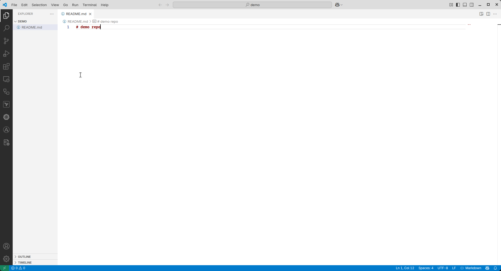
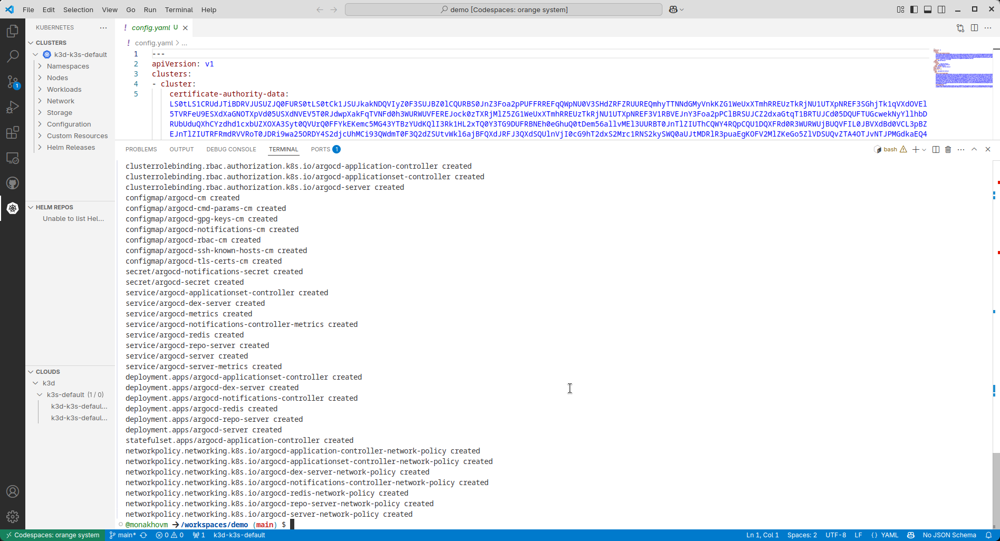
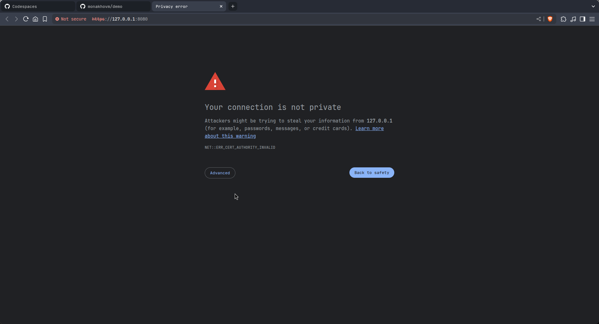

# Демо-інструкція на отримання доступу до інтерфейсу ArgoCD

## Створення кластеру
---
### Підготовка до створення кластеру

1. Відкрити VSCode
    

1. Створити контент в поточному каталозі, щоб Codespaces дозволив створити інстанс
    

1. Створити репозиторій на Github
    ```
    gh repo create <username>/<repo-name> --public
    ```

1. Ініціалізувати локальний репозиторій
    ```
    git init
    ```

1. Додати файли до індексу
    ```
    git add .
    ```

1. Зробити перший коміт
    ```
    git commit -m "Initial commit"
    ```

1. Зв'язати локальний репозиторій з віддаленим
    ```
    git remote add origin https://github.com/<username>/<repo-name>
    ```

1. Відправити зміни на віддалений репозиторій
    ```
    git push -u origin main
    ```

### Створення кластеру

1. Встановити розширення для роботи з Github Codespaces
    

1. Створити новий Codespace
    

1. Вибрати репозиторій
    

1. Обрати стандартну гілку
    

1. Вибрати тип інстансу
    

1. Дочекатись створення інстансу
    
    

1. На Codespace встановити розширення K3D
    

1. Встановити K3D
    

1. Створити kubernetes кластер
    ```
    /home/codespace/.vs-kubernetes/tools/k3d/k3d cluster create <cluster-name> 
    ```
    

### Доступ до кластеру

1. Отримати кофігурацію кластеру для kubectl
    ```
    /home/codespace/.vs-kubernetes/tools/k3d/k3d kubeconfig get <cluster-name> > config.yaml
    ```

1. В K3D розширенні натиснути на три крапки навпроти CLUSTERS і обрати "Set Kubeconfig"
    

1. Обрати файл з config.yaml
    

1. В панелі K3D з'являться елементи кластеру
    

---
## Встановлення та налаштування ArgoCD
---
1. Створити namespace argocd
    ```
    kubectl create namespace argocd
    ```

1. Встановити ArgoCD
    ```
    kubectl apply -n argocd -f https://raw.githubusercontent.com/argoproj/argo-cd/stable/manifests/install.yaml
    ```
    
    

1. Дочекатись завершення встановлення
    

1. Отримати доступ до ArgoCD
    ```
    kubectl port-forward svc/argocd-server -n argocd 8080:443
    ```

1. Відкрити браузер та перейти за адресою http://localhost:8080
    
    

1. Отримати пароль для доступу до ArgoCD
    ```
    kubectl get secret argocd-initial-admin-secret -n argocd -o jsonpath="{.data.password}" | base64 -d; echo
    ```

1. Ввести логін admin та пароль, отриманий на попередньому кроці
    
    

---